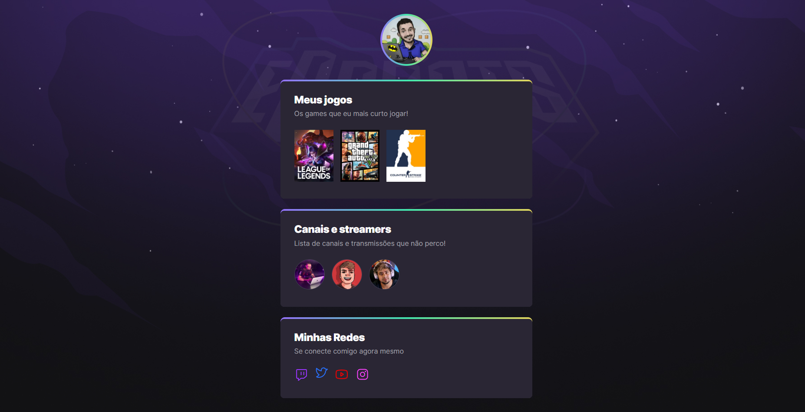

# NLW eSports 

# Projeto de Página de Games Favoritos 🎮

Este é o repositório para a minha página pessoal sobre os games que mais curto jogar e streamers que mais curto assistir. O projeto foi desenvolvido durante o evento Next Level Week da Rocketseat. 🚀

## Tecnologias Utilizadas 🛠️

- HTML
- CSS
- Git e Github
- Flexbox (display flex)
- Animações

## Descrição do Projeto 📄

A página de Games Favoritos foi criada com o objetivo de compartilhar os jogos que mais gosto de jogar e streamers que mais curto assistir. Foi desenvolvida utilizando HTML e CSS para estruturar e estilizar o conteúdo. O Git e o Github foram utilizados para controle de versão e hospedagem do projeto.

## Funcionalidades ⚙️

- Apresentação dos meus games favoritos
- Informações e imagens
- Layout responsivo para se adaptar a diferentes dispositivos
- Utilização de animações para tornar a página mais interativa e atraente

## Acesso ao Site 🌐

Você pode acessar o site dos meus games favoritos [clicando aqui](https://leonardorimes.github.io/nlw-esports-explorer/).

## Como Executar o Projeto Localmente ▶️

Para executar o projeto em sua máquina local, siga as instruções abaixo:

1. Faça um clone deste repositório: `git clone https://github.com/seu-usuario/nome-do-repositorio.git`.
2. Navegue até a pasta do projeto: `cd nome-do-repositorio`.
3. Abra o arquivo `index.html` em seu navegador. 🌐

## Licença 📝

Este projeto está licenciado sob a [MIT License](LICENSE).

